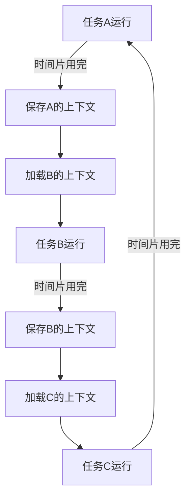

# 第一天： 进程模型

你的问题触及了操作系统中进程调度的核心概念。**单进程模型确实可以实现某种形式的任务切换，但这与真正的多任务调度有本质区别**。让我用「外科手术式」的精准分析，帮你理清这些概念。

---

### 一、**单进程模型的局限性**
#### 1. **单进程任务切换的本质**
```text
🩺 症状：     单进程模型中的任务切换是「协作式」的
💊 诊断：     任务必须主动让出CPU，否则会独占资源
🔬 解剖：     无法应对任务卡死或恶意占用CPU的情况
```

#### 2. **以你的ABC任务为例**
```go
// 伪代码示例：单进程协作式调度
func taskA() {
    for {
        // 处理任务A
        if needSwitch {
            switchTo(taskB)  // 主动让出CPU
        }
    }
}

func taskB() {
    for {
        // 处理任务B
        if needSwitch {
            switchTo(taskC)  // 主动让出CPU
        }
    }
}
```

**问题**：
- 如果taskA没有主动调用`switchTo`，其他任务永远得不到执行
- 无法处理taskA陷入死循环或系统调用阻塞的情况

---

### 二、**多进程模型的调度机制**
#### 1. **操作系统调度器的核心功能**
```text
🛠️ 抢占式调度：  操作系统强制切换任务，无需任务配合
🧩 时间片轮转：  每个任务分配固定时间片，用完后强制切换
📦 优先级管理：  高优先级任务优先执行
📡 状态管理：    处理任务阻塞、唤醒等状态转换
```

#### 2. **多进程调度的优势**


**关键点**：
- 操作系统通过硬件定时器中断实现强制切换
- 每个任务有自己的地址空间，互不干扰
- 调度器维护全局任务队列，公平分配CPU时间

---

### 三、**单进程 vs 多进程调度对比**
| 特性                | 单进程协作式调度          | 多进程抢占式调度          |
|---------------------|--------------------------|--------------------------|
| 切换方式            | 任务主动让出CPU           | 操作系统强制切换          |
| 响应性              | 依赖任务配合，可能卡死    | 实时响应，不会卡死        |
| 隔离性              | 任务间共享内存，可能冲突  | 每个任务独立地址空间      |
| 实现复杂度          | 简单，但功能有限          | 复杂，但功能强大          |
| 适用场景            | 简单嵌入式系统            | 通用操作系统              |

---

### 四、**现代操作系统的调度策略**
#### 1. **Linux CFS调度器**
- 完全公平调度（Completely Fair Scheduler）
- 使用红黑树管理任务队列
- 动态调整任务优先级

#### 2. **Windows优先级调度**
- 32个优先级级别
- 实时任务优先于普通任务
- 动态提升交互式任务优先级

#### 3. **实时操作系统调度**
- 硬实时：严格保证任务时限
- 软实时：尽量满足任务时限

---

### 五、**调度器的实现原理**
#### 1. **上下文切换**
```assembly
# x86架构上下文切换示例
switch_to:
    pusha                  # 保存当前任务寄存器
    mov [eax], esp         # 保存当前任务栈指针
    mov esp, [ebx]         # 加载新任务栈指针
    popa                   # 恢复新任务寄存器
    ret                    # 切换到新任务
```

#### 2. **时间片管理**
```c
// 伪代码：时间片轮转调度
void scheduler() {
    while (1) {
        Task *next = pick_next_task();  // 选择下一个任务
        switch_to(next);                // 切换到该任务
        sleep(time_slice);              // 等待时间片用完
    }
}
```

#### 3. **优先级反转解决**
```text
🔧 优先级继承：  低优先级任务继承高优先级任务的优先级
🧩 优先级天花板：设置资源访问的最高优先级
```

---

### 六、**总结：为什么需要真正的调度器**
1. **可靠性**：防止单个任务卡死整个系统
2. **公平性**：确保所有任务都能获得CPU时间
3. **实时性**：快速响应高优先级任务
4. **隔离性**：防止任务间相互干扰

**你的理解没有错，但单进程模型的「调度」只是最基础的协作式切换，无法满足现代操作系统的需求。真正的调度器是一个复杂的系统，需要硬件支持、操作系统内核配合，以及精心设计的调度算法。**

希望这个「外科手术式」的解析能帮你理清思路。记住：理解调度器的设计哲学，比记住具体实现更重要。🚀


# 转折. cpu 对进程的态度和线程的态度是一样的


CPU 调度切换的是进程和线程。尽管线程看起来很美好，但实际上多线程开发设计会变得更加复杂，要考虑很多同步竞争等问题，如锁、竞争冲突等。


---

### 一、**单进程模型在单个CPU核心上的工作方式**
#### 1. **图形化表示**
```text
时间轴： |----进程A----|----进程A----|----进程A----|----进程A----|
CPU核心： [核心1]       [核心1]       [核心1]       [核心1]
```

**解释**：
- 单个CPU核心全程只运行一个进程（进程A）。
- 进程A独占CPU核心，直到它主动让出CPU（如等待I/O操作完成）。
- 如果没有其他进程竞争CPU，进程A会一直运行。

#### 2. **特点**
```text
🩺 优点：     简单，无需上下文切换
💊 缺点：     无法并发执行多个任务
🔬 适用场景： 嵌入式系统、简单任务
```

---

### 二、**多进程模型在单个CPU核心上的工作方式**
#### 1. **图形化表示**
```text
时间轴： |----进程A----|----进程B----|----进程C----|----进程A----|----进程B----|
CPU核心： [核心1]       [核心1]       [核心1]       [核心1]       [核心1]
```

**解释**：
- 操作系统通过**时间片轮转**调度多个进程。
- 每个进程分配一个时间片（如10ms），时间片用完后强制切换到下一个进程。
- 进程切换时，操作系统会保存当前进程的上下文（寄存器、程序计数器等），并加载下一个进程的上下文。

#### 2. **特点**
```text
🩺 优点：     可以并发执行多个任务
💊 缺点：     上下文切换开销大
🔬 适用场景： 多任务操作系统
```

---

### 三、**多线程模型在单个CPU核心上的工作方式**
#### 1. **图形化表示**
```text
时间轴： |----线程A----|----线程B----|----线程C----|----线程A----|----线程B----|
CPU核心： [核心1]       [核心1]       [核心1]       [核心1]       [核心1]
```

**解释**：
- 单个进程内包含多个线程（线程A、线程B、线程C）。
- 线程共享进程的地址空间和资源，但拥有独立的栈和寄存器。
- 操作系统通过**时间片轮转**调度多个线程，类似于多进程模型。

#### 2. **特点**
```text
🩺 优点：     线程切换开销小，资源共享方便
💊 缺点：     线程间共享资源可能导致竞争和死锁
🔬 适用场景： 并发任务，如Web服务器、数据库系统
```

---

### 四、**单进程 vs 多进程 vs 多线程的对比**
| 特性                | 单进程模型                | 多进程模型                | 多线程模型                |
|---------------------|--------------------------|--------------------------|--------------------------|
| 并发能力            | 无                       | 有                       | 有                       |
| 上下文切换开销      | 无                       | 大                       | 小                       |
| 资源共享            | 无                       | 无                       | 有                       |
| 隔离性              | 高                       | 高                       | 低                       |
| 适用场景            | 简单任务                 | 多任务操作系统            | 并发任务                 |

---

### 五、**总结**
- **单进程模型**：单个CPU核心全程只运行一个进程，适合简单任务。
- **多进程模型**：通过时间片轮转在单个CPU核心上并发运行多个进程，适合多任务操作系统。
- **多线程模型**：通过时间片轮转在单个CPU核心上并发运行多个线程，适合并发任务。

希望这些图形化的解释能帮你更好地理解单进程、多进程和多线程模型在单个CPU核心上的工作方式。记住：理解设计哲学，比记住具体实现更重要。🚀


# 调度器：

olang调度器引入了三个结构来对调度的过程建模：

- _G_ 代表一个Goroutine；
- _M_ 代表一个操作系统的线程；
- _P_ 代表一个CPU处理器，通常P的数量等于CPU核数（_GOMAXPROCS_）。

       三者都在runtime2.go中定义，他们之间的关系如下：

- _G_需要绑定在_M_上才能运行；
- _M_需要绑定_P_才能运行；
- 程序中的多个_M_并不会同时都处于执行状态，最多只有_GOMAXPROCS_个_M_在执行。