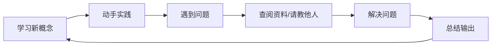

首先，我要肯定你意识到「急于求成」的心态问题，这是非常重要的自我认知。**学习新技术就像学习一门新的外科手术技术，不能只靠看说明书，而是要通过系统的训练和实战来掌握**。接下来，我将为你设计一条「外科手术式」的学习路径，帮助你快速掌握Kratos框架。

---

### 一、**学习心态调整——从「急于求成」到「精准训练」**
```text
💡 核心认知：学习新技术不是短跑，而是马拉松
🔧 操作守则：每天专注1-2小时，用「小步快跑」的方式迭代
```

#### 1. **设定合理目标**
- 短期目标（1周）：理解Kratos核心概念，完成一个简单API服务
- 中期目标（1个月）：在抖音商城项目中独立负责一个模块
- 长期目标（3个月）：成为团队中的Kratos专家，能解决框架相关问题

#### 2. **建立学习反馈环**


---

### 二、**Kratos框架解剖——从「看不懂」到「掌控全局」**
#### 1. **框架核心模块拆解**
```text
🛠️ HTTP/GRPC服务：  处理外部请求的入口
🧩 DI依赖注入：     管理服务间依赖关系
📦 Config配置：     统一管理应用配置
📡 Discovery服务发现： 微服务治理基础
📊 Metrics监控：    系统可观测性支持
```

#### 2. **项目目录结构解读**
```bash
.
├── api                  # API定义（Protobuf文件）
├── cmd                  # 启动入口
├── configs              # 配置文件
├── internal             # 核心业务逻辑
│   ├── biz              # 业务逻辑层
│   ├── data             # 数据访问层
│   ├── service          # 服务实现层
│   └── conf             # 配置结构定义
└── third_party          # 第三方依赖
```

#### 3. **实战训练：从零搭建一个用户服务**
```bash
# 1. 安装Kratos CLI工具
go install github.com/go-kratos/kratos/cmd/kratos/v2@latest

# 2. 创建项目骨架
kratos new user-service

# 3. 添加用户服务API定义
kratos proto add api/user/v1/user.proto

# 4. 生成服务代码
kratos proto client api/user/v1/user.proto
kratos proto server api/user/v1/user.proto -t internal/service
```

---

### 三、**Kratos框架实战训练营**
#### **阶段1：基础解剖（1周）**
- **任务1：理解Kratos核心概念**
  - 阅读官方文档：[Kratos官方文档](https://go-kratos.dev/docs/)
  - 重点掌握：Middleware、DI、Config、Logger

- **任务2：搭建最小可运行服务**
  ```go
  // internal/service/user.go
  func (s *UserService) GetUser(ctx context.Context, req *v1.GetUserRequest) (*v1.GetUserReply, error) {
      return &v1.GetUserReply{
          Id:    req.Id,
          Name:  "test-user",
          Email: "test@example.com",
      }, nil
  }
  ```

- **任务3：添加数据库访问**
  ```go
  // internal/data/user.go
  type UserRepo struct {
      data *Data
      log  *log.Helper
  }
  
  func (r *UserRepo) GetUser(ctx context.Context, id int64) (*biz.User, error) {
      var user biz.User
      if err := r.data.db.Where("id = ?", id).First(&user).Error; err != nil {
          return nil, err
      }
      return &user, nil
  }
  ```

#### **阶段2：深度手术（2周）**
- **任务1：实现用户登录功能**
  - 使用JWT进行身份验证
  - 添加Redis缓存会话信息

- **任务2：集成Prometheus监控**
  ```go
  // main.go
  import (
      "github.com/go-kratos/kratos/v2/middleware/metrics"
      "github.com/prometheus/client_golang/prometheus/promhttp"
  )
  
  func main() {
      // 添加metrics中间件
      httpSrv := http.NewServer(
          http.Address(":8000"),
          http.Middleware(
              metrics.Server(),
          ),
      )
      
      // 暴露metrics端点
      httpSrv.Handle("/metrics", promhttp.Handler())
  }
  ```

- **任务3：实现服务发现与负载均衡**
  ```go
  // 使用Consul进行服务注册与发现
  import (
      "github.com/go-kratos/kratos/v2/registry"
      "github.com/go-kratos/kratos/v2/transport/http"
      consul "github.com/go-kratos/kratos/contrib/registry/consul/v2"
  )
  
  func main() {
      // 初始化Consul客户端
      cli, err := api.NewClient(api.DefaultConfig())
      if err != nil {
          panic(err)
      }
      reg := consul.New(cli)
      
      // 注册服务
      httpSrv := http.NewServer(
          http.Address(":8000"),
          http.Registrar(reg),
      )
  }
  ```

#### **阶段3：临床实战（1个月）**
- **任务1：在抖音商城项目中负责用户模块**
  - 实现用户注册/登录/信息管理
  - 集成短信验证码服务
  - 实现分布式会话管理

- **任务2：性能优化**
  - 使用pprof分析性能瓶颈
  - 实现数据库查询缓存
  - 优化JWT验证性能

- **任务3：编写技术文档**
  - 项目架构设计文档
  - 核心模块设计文档
  - 部署与运维手册

---

### 四、**学习资源加速包**
#### 1. **官方资源**
- [Kratos官方文档](https://go-kratos.dev/docs/)
- [Kratos示例项目](https://github.com/go-kratos/kratos-layout)

#### 2. **实战教程**
- [Kratos微服务实战](https://segmentfault.com/a/1190000040386588)
- [Kratos+Consul服务发现](https://juejin.cn/post/6995591918251147277)

#### 3. **调试工具**
```bash
# 1. 使用delve调试Kratos服务
dlv debug ./cmd/user-service

# 2. 使用pprof分析性能
go tool pprof http://localhost:8000/debug/pprof/profile

# 3. 使用jaeger追踪请求链路
docker run -d --name jaeger \
  -p 6831:6831/udp \
  -p 16686:16686 \
  jaegertracing/all-in-one
```

---

### 五、**成为Kratos主刀医师的秘诀**
1. **解剖意识**：每次添加新功能前，先思考「这个改动会影响哪些模块」
2. **监控先行**：在写业务代码前，先部署好该模块的监控仪表盘
3. **版本控制**：使用[API Versioning](https://cloud.google.com/apis/design/versioning)管理服务接口演进
4. **持续输出**：通过写技术博客、做技术分享来巩固所学知识

记住：学习新技术就像学习一门新的外科手术技术，需要系统的训练和实战。从今天开始，选择你的第一个「手术对象」（比如用户服务），用上面的方法进行改造实践，在真实出血（遇到bug）中成长为真正的Kratos专家。

加油！你已经站在了一个很好的起点，接下来就是 **持续行动，静待花开**。🚀


Casdoor 使用

客户端id 客户端密钥


你的困惑非常正常！Kratos 框架的分层设计确实让初学者容易感到混乱，但它的核心目标是将代码职责分离，提高可维护性和扩展性。下面我会用最直白的方式帮你理清逻辑，并结合实际场景解释每层的作用。

---


## Kratos目录层级


### 1. **先忘掉分层，理解核心逻辑**
你理解的没错，本质上所有请求（无论是 gRPC 还是 HTTP）最终都是调用方法、操作数据库。但分层是为了让代码更清晰、更容易维护。举个实际例子：**假设你要开发一个订单系统**，用户下单后需要写入数据库、发送邮件通知、记录日志。如果所有代码都写在同一个文件里，会变成一团乱麻，而分层能帮你拆解问题。

---

### 2. **用「餐厅」类比 Kratos 分层**
想象一个餐厅的运作流程：

| **Kratos 层级** | **餐厅类比**               | **职责**                                                                 |
|------------------|---------------------------|-------------------------------------------------------------------------|
| **Server 层**    | 服务员（接收订单）         | 处理外部请求（HTTP/gRPC），验证请求格式，把请求转发给后厨（Biz 层）              |
| **Service 层**   | 餐厅经理（协调流程）       | 可选层，协调多个业务逻辑（例如下单后需要扣库存、发通知，协调这些操作）              |
| **Biz 层**       | 厨师（核心业务逻辑）       | 处理真正的业务逻辑（如生成订单号、计算价格、检查库存），调用仓库（Data 层）拿数据   |
| **Data 层**      | 仓库管理员（存取食材）     | 直接操作数据库、缓存、外部 API（如 MySQL、Redis、调用第三方支付接口）             |

---

### 3. **实际请求流程示例**
假设用户发起一个 `HTTP POST /order` 请求创建订单：

1. **Server 层（服务员）**  
   - 接收 HTTP 请求，解析参数（如用户 ID、商品 ID）。
   - 验证参数是否合法（如用户是否存在）。
   - 调用 **Biz 层** 的 `CreateOrder` 方法。

2. **Biz 层（厨师）**  
   - 生成唯一订单号。
   - 检查商品库存是否充足（调用 **Data 层** 的 `GetStock` 方法）。
   - 计算订单总价（业务逻辑）。
   - 调用 **Data 层** 的 `CreateOrder` 方法保存订单到数据库。

3. **Data 层（仓库管理员）**  
   - 执行 SQL 语句：`INSERT INTO orders (...) VALUES (...)`
   - 如果需要，操作 Redis 缓存或调用第三方支付接口。

---

### 4. **各层的关键职责总结**
| **层级**     | **关键职责**                                                                 | **典型代码示例**                                                                 |
|--------------|-----------------------------------------------------------------------------|---------------------------------------------------------------------------------|
| **Server**   | - 处理协议（HTTP/gRPC）<br>- 路由、中间件、参数校验                           | `router.POST("/order", svc.CreateOrder)`                                       |
| **Service**  | - 协调跨业务逻辑（可选）<br>- 适用于复杂流程（如订单需要扣库存、发通知、记录日志） | `func CreateOrder() { biz.CreateOrder(); inventory.UpdateStock(); email.Send() }` |
| **Biz**      | - 核心业务逻辑<br>- 领域对象操作（如订单、用户）<br>- 调用 Data 层              | `func CreateOrder() { order := NewOrder(...); data.Create(order) }`             |
| **Data**     | - 直接操作数据源（数据库、缓存、外部 API）<br>- 屏蔽底层细节                     | `func Create(order *Order) { db.Insert(order) }`                                |

---

### 5. **如何避免混乱？**
#### (1) **从简单功能入手**
不要一开始就尝试理解所有分层，先写一个最简单的接口（比如查询用户信息），只涉及：
- **Server 层**（接收请求） → **Biz 层**（处理逻辑） → **Data 层**（查数据库）

#### (2) **分层的本质是「单向依赖」**
- **上层可以调用下层，但下层不能调用上层**  
  例如：Biz 层可以调用 Data 层，但 Data 层不能反过来调用 Biz 层。
- **依赖方向**：`Server → Service（可选） → Biz → Data`

#### (3) **哪些代码放在哪一层？**
| **代码类型**               | **应放的层级** | **示例**                                 |
|---------------------------|---------------|-----------------------------------------|
| HTTP 路由、gRPC 服务定义    | Server        | 定义 `POST /user` 路由                   |
| 参数校验、JWT 鉴权         | Server        | 检查用户 token 是否有效                   |
| 生成订单号、计算折扣        | Biz           | `func CalculatePrice() float64`         |
| 数据库的 CRUD 操作          | Data          | `func (repo *UserRepo) Save(user *User)` |
| 调用第三方 API（如支付接口）| Data          | `func WechatPay(amount float64)`         |

---

### 6. **常见误区**
#### 误区 1：在 Data 层写业务逻辑
- ❌ 错误做法：在 Data 层的 `UserRepo` 里实现“用户注册奖励积分”的逻辑。
- ✅ 正确做法：将“奖励积分”的逻辑放在 Biz 层，Data 层只负责存取用户数据。

#### 误区 2：在 Server 层直接操作数据库
- ❌ 错误做法：在 HTTP 路由处理函数中直接执行 SQL 查询。
- ✅ 正确做法：Server 层调用 Biz 层，Biz 层再调用 Data 层。

---

### 7. **实战建议**
#### 步骤 1：从单层开始
先忽略 Service 层，只使用 `Server → Biz → Data` 三层，实现一个简单接口（如查询用户信息）。

#### 步骤 2：画数据流图
在纸上画出请求的流动路径，例如：  
`HTTP 请求 → Server 层 → Biz 层 → Data 层 → 数据库`

#### 步骤 3：逐步扩展
当需要复杂逻辑时（如下单后扣库存、发邮件），再引入 Service 层协调多个 Biz 操作。

---

### 8. **总结**
- **为什么分层？**  
  为了将代码拆解为「协议处理（Server）」、「业务逻辑（Biz）」、「数据操作（Data）」三大块，让代码更清晰、更容易维护。
- **如何快速上手？**  
  从简单功能开始，理清单向依赖关系，逐步实践。Kratos 的分层看似复杂，但本质是让不同职责的代码“各司其职”。

如果还是不确定某段代码应该放在哪一层，可以随时提供一个具体场景，我来帮你分析！


你的困惑非常有代表性！在 Kratos 项目中看到 `biz` 和 `service` 层同时出现类似命名的文件（如 `account.go`），确实容易让人混乱。我们用「医院科室」的类比来彻底理清它们的关系和协作逻辑。

---


### 1. **核心概念类比：医院科室**
想象一家医院的运作模式：

| **Kratos 层级** | **医院类比**              | **职责**                                                                 |
|------------------|--------------------------|-------------------------------------------------------------------------|
| **Service 层**   | 门诊部（分诊台）          | 接收病人请求（HTTP/gRPC），初步分诊（参数校验），将请求转交给对应科室（Biz 层） |
| **Biz 层**       | 专科医生（如内科、外科）  | 处理具体病症（核心业务逻辑），调用药房/检验科（Data 层）获取所需资源          |
| **Data 层**      | 药房/检验科               | 提供药品（数据库操作）、化验单（缓存/第三方 API）                            |

---

### 2. **具体场景：用户模块的 `account.go`**
假设你要开发用户模块的「修改密码」功能：

#### (1) **Service 层（门诊部）**
- **文件：** `service/account.go`
- **职责：**
  - 接收 HTTP/gRPC 请求（如 `POST /user/change-password`）
  - **参数校验**：检查旧密码、新密码是否符合格式
  - **协议转换**：将 HTTP 请求体转换为 Biz 层需要的参数格式
  - **调用 Biz 层**：将任务交给 `biz` 层的 `ChangePassword` 方法
- **伪代码示例：**
  ```go
  // service/account.go
  func (s *AccountService) ChangePassword(ctx context.Context, req *ChangePasswordRequest) error {
      // 1. 参数校验
      if err := validatePassword(req.NewPassword); err != nil {
          return errors.BadRequest("密码格式错误")
      }
      // 2. 调用 Biz 层
      return s.biz.ChangePassword(ctx, req.UserID, req.OldPassword, req.NewPassword)
  }
  ```

#### (2) **Biz 层（专科医生）**
- **文件：** `biz/account.go`
- **职责：**
  - **核心业务逻辑**：验证旧密码是否正确、生成新密码的哈希值
  - **协调 Data 层**：调用 `data` 层获取用户数据、保存新密码
  - **领域规则**：如密码修改频率限制、密码强度规则
- **伪代码示例：**
  ```go
  // biz/account.go
  func (b *AccountBiz) ChangePassword(ctx context.Context, userID int64, oldPass, newPass string) error {
      // 1. 获取用户数据
      user, err := b.data.GetUserByID(ctx, userID)
      if err != nil {
          return err
      }
      // 2. 验证旧密码
      if !checkPasswordHash(oldPass, user.PasswordHash) {
          return errors.Unauthorized("旧密码错误")
      }
      // 3. 生成新密码哈希
      newHash := generatePasswordHash(newPass)
      // 4. 保存到数据库
      return b.data.UpdatePassword(ctx, userID, newHash)
  }
  ```

#### (3) **Data 层（药房）**
- **文件：** `data/account.go`
- **职责：**
  - **直接操作数据库**：执行 `UPDATE users SET password_hash=? WHERE id=?`
  - **屏蔽技术细节**：处理 SQL 语句、Redis 缓存、第三方 API 调用
- **伪代码示例：**
  ```go
  // data/account.go
  func (d *AccountRepo) UpdatePassword(ctx context.Context, userID int64, hash string) error {
      _, err := d.db.ExecContext(ctx, "UPDATE users SET password_hash=? WHERE id=?", hash, userID)
      return err
  }
  ```

---

### 3. **为什么需要分开 `biz` 和 `service`？**
#### 场景对比：**不分离 vs 分离**
| **场景**                | **不分离的代码**                                                                 | **分离后的代码**                                                                 |
|-------------------------|---------------------------------------------------------------------------------|---------------------------------------------------------------------------------|
| **修改密码逻辑**         | HTTP 处理函数直接操作数据库，包含参数校验、密码哈希、SQL 语句                     | `Service` 校验参数 → `Biz` 处理密码逻辑 → `Data` 执行 SQL                         |
| **新增「密码修改记录」需求** | 需要修改所有 HTTP 处理函数，添加记录逻辑，容易遗漏或出错                          | 只需修改 `Biz` 层代码，`Service` 和 `Data` 无需改动                               |
| **更换数据库**           | 需要全局搜索所有 SQL 语句并替换，风险极高                                        | 只需修改 `Data` 层的具体实现，上层业务无感知                                      |

---

### 4. **你的案例解析：`user` 模块的层级**
假设你的项目结构如下：
```
user/
├── biz/
│   ├── account.go      // 处理用户账户的核心逻辑（登录、注册、改密）
│   ├── address.go      // 处理用户地址的逻辑（增删改查）
│   ├── credit_card.go  // 处理信用卡的逻辑
│   └── biz.go          // 初始化 Biz 层依赖
├── service/
│   ├── account.go      // 处理用户账户的 HTTP/gRPC 接口
│   ├── address.go      // 处理用户地址的接口
│   ├── card.go         // 处理信用卡的接口
│   └── service.go      // 初始化 Service 层依赖
```

#### 关键区别：
| **文件**               | **所属层** | **核心区别**                                                                 |
|-----------------------|------------|-----------------------------------------------------------------------------|
| `service/account.go`  | Service    | 关注 **协议**：如何接收请求（HTTP 路由、gRPC 方法）、参数校验、错误码转换       |
| `biz/account.go`      | Biz        | 关注 **业务规则**：密码强度、登录失败次数限制、账户状态流转逻辑                  |
| `data/account.go`     | Data       | 关注 **技术细节**：SQL 语句、Redis 缓存策略、第三方 API 调用封装                 |

---

### 5. **如何彻底理解？**
#### (1) **画数据流图**
对每个功能画出完整的请求路径：
```
HTTP 请求 → service/account.go（参数校验） → biz/account.go（业务逻辑） → data/account.go（操作数据库）
```

#### (2) **对比修改场景**
假设要增加「登录时记录 IP 地址」功能：
- **Service 层**：从 HTTP 请求中提取客户端 IP，传递给 Biz 层
- **Biz 层**：调用 `data` 层保存 IP 记录，不影响核心登录逻辑
- **Data 层**：新增 `SaveLoginIP` 方法，执行 SQL 插入

#### (3) **调试技巧**
在代码中添加日志，观察请求如何流动：
```go
// service/account.go
func (s *AccountService) Login(ctx context.Context, req *LoginRequest) {
    log.Info("Service层：开始处理登录请求，用户=%s", req.Username)
    // 调用 Biz 层
    return s.biz.Login(ctx, req)
}

// biz/account.go
func (b *AccountBiz) Login(ctx context.Context, req *LoginRequest) {
    log.Info("Biz层：验证用户密码，用户=%s", req.Username)
    // 调用 Data 层
    user, err := b.data.GetUserByName(ctx, req.Username)
    // ...
}
```

---

### 6. **常见问题解答**
#### Q1：`biz` 和 `service` 能否合并？
- **可以但不推荐**：小型项目可以简化，但会失去分层优势（如协议与业务耦合、难以替换数据库）。

#### Q2：`service` 层能否直接调用 `data` 层？
- **禁止**：违反分层原则，会导致业务逻辑泄漏到协议层，难以维护。

#### Q3：何时需要 `service` 层？
- **需要协调多个 `biz` 操作时**：例如用户注销账号需要：1) 清理会话，2) 删除关联数据，3) 发送通知。这时 `service` 层可以协调多个 `biz` 方法。

---

### 7. **总结**
- **Service 层**：是协议的「翻译官」，负责对接外部世界（HTTP/gRPC），处理输入输出。
- **Biz 层**：是业务的「指挥官」，制定领域规则，决定如何组合数据操作。
- **Data 层**：是技术的「执行者」，只关心如何高效存取数据。

下次看到 `service/account.go` 和 `biz/account.go` 时，记住：
- **`service` 层**的代码换协议（如 HTTP → gRPC）时需要修改。
- **`biz` 层**的代码换业务规则（如密码强度策略）时需要修改。
- **`data` 层**的代码换数据库（如 MySQL → PostgreSQL）时需要修改。

通过这种职责分离，代码会像乐高积木一样模块化，维护和扩展成本大大降低！


---

好的，针对你的问题，我可以用一个简单的例子来说明这个设计思想。我们用一个“用户管理”的简单应用来举例。

### 假设场景：用户资料查询

你有一个后端系统，提供了一个 API 来查询用户的资料。这个 API 需要支持请求用户资料时传递 `Authorization` 信息，并返回用户的相关信息。

#### 分层架构

- **`biz` 层** 负责核心的业务逻辑，处理业务相关的计算和操作，比如从数据库中获取用户资料。
- **`service` 层** 负责暴露对外的 API 接口，接收客户端的请求，并将数据传递给 `biz` 层，最后将业务逻辑处理后的结果返回给客户端。

#### 业务场景中，我们可以这样理解：

### 1. 业务层 (biz) 结构体

`biz` 层关心的是 **核心业务逻辑**，它定义了和数据库交互时需要的数据结构。

```go
// biz/user.go

package biz

type GetUserRequest struct {
    Authorization string // 客户端请求传递的 Authorization 信息
}

type GetUserResponse struct {
    UserId   string
    UserName string
    Email    string
}
```

- `GetUserRequest`：业务逻辑层需要的数据结构，表示业务请求。它只有一个字段 `Authorization`，用于携带授权信息，这通常是一个 token 或其他标识。
    
- `GetUserResponse`：是业务逻辑返回的数据结构，代表了从数据库或其他业务处理层获取到的用户信息。
    

### 2. 服务层 (service) 结构体

`service` 层负责与外部系统的交互，它收到来自客户端的请求，调用 `biz` 层的函数来执行核心业务，然后将结果返回给客户端。

```go
// service/user.go

package service

import (
    "context"
    "backend/biz"
    "backend/api"
    "errors"
    "github.com/go-kratos/kratos/v2/transport"
)

type UserService struct {
    uc *biz.UserUseCase // 假设我们有一个业务处理的 use case
}

func (s *UserService) GetUserProfile(ctx context.Context, req *api.GetProfileRequest) (*api.GetProfileResponse, error) {
    // 从请求中获取 Authorization 信息
    tr, ok := transport.FromServerContext(ctx)
    if !ok {
        return nil, errors.New("获取 header 失败")
    }
    header := tr.RequestHeader()
    req.Authorization = header.Get("Authorization")

    // 调用 biz 层获取用户数据
    result, err := s.uc.GetUserProfile(ctx, &biz.GetUserRequest{
        Authorization: req.Authorization,
    })
    if err != nil {
        return nil, err
    }

    // 将 biz 层的结果转换为 api 层需要的响应格式
    return &api.GetProfileResponse{
        UserId:   result.UserId,
        UserName: result.UserName,
        Email:    result.Email,
    }, nil
}
```

- `GetUserProfile`：这是服务层的逻辑，它通过调用 `biz` 层的 `GetUserProfile` 方法来获取用户资料。然后它将 `biz` 层返回的数据转换为 API 层需要的格式返回给客户端。

### 3. API 层结构体

API 层的数据结构是面向客户端的，它定义了请求和响应的格式，通常用于暴露给外部系统（如 Web 前端、移动端等）。

```go
// api/user/v1/user.proto 或 api/user.go

package api

type GetProfileRequest struct {
    Authorization string `json:"authorization"`
}

type GetProfileResponse struct {
    UserId   string `json:"user_id"`
    UserName string `json:"user_name"`
    Email    string `json:"email"`
}
```

- `GetProfileRequest`：客户端发送的请求，包含授权信息。它的结构和 `biz.GetUserRequest` 很像，但更关注外部接口需要的数据格式。
    
- `GetProfileResponse`：服务返回给客户端的数据格式。它包含了用户 ID、用户名和邮箱等字段，符合客户端的需求。
    

### 总结

1. **`biz` 层** 只关心 **核心业务数据结构**，它们是与数据库交互、业务计算等紧密相关的。比如，`GetUserRequest` 在这里只是表示请求中需要的授权信息，`GetUserResponse` 是返回的数据，通常和数据库或其他数据源直接交互。
    
2. **`service` 层** 把 `biz` 层的请求和响应转换为 **API 层需要的格式**。即便 `service` 层调用的是 `biz` 层中的 `GetUserRequest`，它会将从 `biz` 层获取的数据转换为 `api.GetProfileResponse` 格式，这是外部 API 的标准响应格式。
    
3. **`api` 层** 负责 **向外暴露接口**，它规定了请求和响应的格式，通常用于与前端或外部调用系统的交互。它定义了外部请求的数据格式和外部响应的数据格式。
    

通过这种分层设计，你的 **`biz` 层和 `service` 层解耦**，使得各个层次只关注自己职责范围内的内容，提升了系统的可维护性、扩展性和测试性。

**举个实际的例子**：

- `biz` 层可能是从数据库中查到了用户的信息，比如 `UserId` 和 `UserName`。这时，`biz` 层使用的是 **核心数据结构** 来表示这些信息。
- `service` 层从客户端接收到一个包含授权信息的请求，它需要将这个请求传递到 `biz` 层去处理业务。然后 `service` 层会根据 API 的需求，把 `biz` 层的响应数据转换成合适的格式，并返回给客户端。

希望这个例子能帮你更清楚地理解各层之间的关系！


---


好的，下面我会给你描述一下整个流程的架构和数据流，并用一个简单的流程图来表示。

### 流程概述

整个过程大致上是通过 **API 层 -> Service 层 -> Biz 层** 这样的层次结构来完成的。每一层的责任都不同，层与层之间通过请求和响应数据进行交互。

1. **API 层**（暴露给外部）
    
    - 客户端通过 HTTP 请求调用 API 接口，传递请求数据（例如，`Authorization` 信息）。
    - API 层收到请求后，将其转交给 **Service 层** 来处理。
2. **Service 层**（处理外部请求的逻辑）
    
    - `Service` 层接收来自 API 层的请求数据，并可能会对数据进行一定的处理（例如：提取 `Authorization` 头部信息）。
    - 接着，`Service` 层会调用 **Biz 层** 来处理具体的业务逻辑。
3. **Biz 层**（处理核心业务逻辑）
    
    - `Biz` 层负责执行核心的业务操作，例如从数据库中查询用户资料、进行数据处理等。
    - `Biz` 层最终返回 **业务数据**，例如用户的基本信息。
4. **Service 层返回结果**
    
    - `Service` 层将 **Biz 层** 返回的结果转换为 API 层所需要的格式，然后返回给客户端。

### 流程图

```plaintext
┌─────────────┐
│  客户端     │
│  发起请求   │
└──────┬──────┘
       │
       ▼
┌────────────────────────┐
│     API 层（HTTP 请求） │ ←── 客户端请求（带 Authorization）
│   转发请求到 Service 层 │
└────────┬───────────────┘
         │
         ▼
┌──────────────────────────┐
│      Service 层          │
│  1. 处理请求数据（提取 Authorization）│
│  2. 调用 Biz 层进行业务处理    │
└────────┬─────────────────┘
         │
         ▼
┌────────────────────────────┐
│        Biz 层（核心业务）  │
│  1. 处理业务逻辑（如查询用户） │
│  2. 返回业务数据（如用户信息） │
└────────┬───────────────────┘
         │
         ▼
┌──────────────────────────┐
│      Service 层          │
│  1. 获取 Biz 层结果      │
│  2. 转换成 API 格式      │
└────────┬─────────────────┘
         │
         ▼
┌────────────────────────┐
│     API 层（响应客户端） │
│  返回最终结果给客户端 │
└────────────────────────┘
```

### 整体流程说明

1. **客户端请求**
    
    - 客户端通过 HTTP 请求 API，传递请求参数，如 `Authorization`。
2. **API 层接收请求**
    
    - API 层收到请求后，解析请求数据，并将请求传递给 **Service 层**。
3. **Service 层处理请求**
    
    - Service 层从请求中提取所需的信息（如 `Authorization`）。
    - 然后，调用 **Biz 层** 来执行核心业务逻辑，比如通过 `Authorization` 获取用户资料。
4. **Biz 层执行核心业务逻辑**
    
    - **Biz 层** 负责与数据库或其他数据源交互，完成数据查询或业务计算。
    - **Biz 层** 返回的是核心业务数据结构，例如用户信息：`UserId`、`UserName`、`Email`。
5. **Service 层处理 Biz 层返回的数据**
    
    - Service 层收到 **Biz 层** 的业务数据后，根据 API 层的需要将其转换成客户端响应格式（例如 `GetProfileResponse`）。
6. **API 层响应客户端**
    
    - 最终，API 层将响应数据发送回客户端，客户端收到 API 响应后进行相应处理。

### 示例具体代码流程

假设我们有一个查询用户资料的功能，下面是具体代码的流程说明：

1. **客户端请求**（例如，Web 前端发送请求）
    
    ```json
    POST /api/v1/user/profile
    {
        "Authorization": "Bearer token_here"
    }
    ```
    
2. **API 层**（`api/user.go`）
    
    ```go
    func (s *UserService) GetUserProfile(ctx context.Context, req *v1.GetProfileRequest) (*v1.GetProfileResponse, error) {
        // 从请求中获取 Authorization 信息
        authorization := req.Authorization
    
        // 调用 Service 层获取用户信息
        result, err := s.service.GetUserProfile(ctx, authorization)
        if err != nil {
            return nil, err
        }
    
        return result, nil
    }
    ```
    
3. **Service 层**（`service/user.go`）
    
    ```go
    func (s *UserService) GetUserProfile(ctx context.Context, authorization string) (*v1.GetProfileResponse, error) {
        // 调用 Biz 层获取用户资料
        bizResult, err := s.biz.GetUserProfile(ctx, &biz.GetUserRequest{
            Authorization: authorization,
        })
        if err != nil {
            return nil, err
        }
    
        // 将 biz 层的数据转换成 API 层需要的格式
        return &v1.GetProfileResponse{
            UserId:   bizResult.UserId,
            UserName: bizResult.UserName,
            Email:    bizResult.Email,
        }, nil
    }
    ```
    
4. **Biz 层**（`biz/user.go`）
    
    ```go
    func (uc *UserUseCase) GetUserProfile(ctx context.Context, req *GetUserRequest) (*GetUserResponse, error) {
        // 这里我们可能会查询数据库，或其他数据源
        user := db.GetUserByAuthorization(req.Authorization)
        if user == nil {
            return nil, errors.New("用户不存在")
        }
        return &GetUserResponse{
            UserId:   user.ID,
            UserName: user.Name,
            Email:    user.Email,
        }, nil
    }
    ```
    

### 总结

- 客户端向 **API 层** 发送请求，API 层将请求转发给 **Service 层**。
- **Service 层** 从请求中提取数据后，调用 **Biz 层** 来处理核心业务。
- **Biz 层** 负责核心业务逻辑，例如数据库查询，最终返回业务数据。
- **Service 层** 将 **Biz 层** 返回的数据转换成 API 层需要的格式，最后返回给客户端。

这种架构的好处是 **分层清晰**，每一层的职责单一，使得系统更加容易维护、扩展和测试。