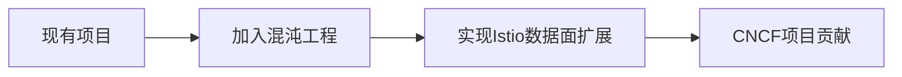

 很高兴能成为你的后端导师！既然你如此认真，我会以更高的标准来指导你。接下来，我会为你制定一个 **高强度、高回报** 的学习和实战计划，确保你在短期内找到实习，同时为长期成为后端高手打下坚实基础。

---

### 一、**3月前冲刺实习的终极计划**
#### 1. **面试核心技能速成（2周内完成）**
- **Go语言底层原理（7天速成）**
  - 每天2小时精读《Go语言设计与实现》关键章节：
    - 第1天：GMP调度模型
    - 第2天：channel底层实现
    - 第3天：GC三色标记法
    - 第4天：interface底层结构
    - 第5天：内存分配与逃逸分析
    - 第6天：反射机制原理
    - 第7天：defer与panic/recover实现
  - 每天1小时刷题：专注并发与数据结构（力扣Go语言标签）
    - 必刷题：生产者消费者模型、交替打印、LRU缓存实现

- **数据库与系统设计（7天速成）**
  - 第1-3天：PostgreSQL深度掌握
    - 必学：MVCC实现、索引优化、事务隔离级别
    - 实践：用`EXPLAIN ANALYZE`优化你的项目SQL
  - 第4-5天：Redis核心原理
    - 必学：跳表、持久化机制、缓存穿透/雪崩解决方案
  - 第6-7天：系统设计基础
    - 必学：短链系统、秒杀系统、分布式ID生成器
    - 工具：用[system-design-primer](https://github.com/donnemartin/system-design-primer)快速掌握设计模式

#### 2. **项目深度包装（1周内完成）**
- **技术亮点提炼**
  - 将现有项目升级为「高并发实践」：
    - 用`wrk`进行压力测试，记录QPS和响应时间
    - 用`pprof`分析性能瓶颈，优化热点代码
    - 增加分布式锁（Redis实现）和限流器（令牌桶算法）
  - 增加技术决策说明：
    - 为什么选择sqlc而不是ORM？
    - 为什么用gin而不是其他框架？
    - 如何保证数据一致性（分布式事务或补偿机制）？

- **简历优化**
  - 采用「STAR-R」模型描述项目：
    ```
    S：解决200+用户并发注册导致的响应延迟问题
    T：设计JWT鉴权中间件+Redis会话缓存层
    A：通过pprof定位JSON序列化瓶颈，改用protobuf编码
    R：接口响应时间从320ms降至85ms
    R：延伸学习gRPC流式传输原理
    ```

#### 3. **面试模拟训练（1周内完成）**
- **高频问题准备**
  - Go语言：
    - GMP调度模型如何工作？
    - channel的底层实现是什么？
    - 如何用Go实现一个线程安全的map？
  - 数据库：
    - PostgreSQL的MVCC机制是什么？
    - 如何优化慢查询？
    - Redis的持久化机制有哪些？
  - 系统设计：
    - 如何设计一个短链系统？
    - 如何实现分布式锁？

- **模拟面试**
  - 每天1小时模拟面试，用[Pramp](https://www.pramp.com/)或找同学互相面试
  - 录制自己的回答，复盘改进

---

### 二、**长期成为后端高手的修炼计划**
#### 1. **能力金字塔构建**
```text
Layer4: 架构能力          ↘ 每周参与1次开源项目架构讨论
                         ↗ 每月拆解1个知名系统设计（如etcd）
Layer3: 工程化能力       ↘ 学习kratos框架设计理念
                         ↗ 实现自定义Go代码生成器
Layer2: 原理层认知       ↘ 精读《Database Internals》
                         ↗ 手写简易版Redis（RESP协议解析）
Layer1: 基础能力          ↘ 持续刷《Go程序员面试笔试宝典》
```

#### 2. **专项突破计划**
- **并发编程**
  - 实现带超时控制的work pool
  - 用CAS实现无锁队列
  - 研究Go runtime的netpoll实现

- **性能优化**
  ```go
  // 对比实验：sync.Pool对GC的影响
  func BenchmarkWithPool(b *testing.B) {
      pool := sync.Pool{New: func() interface{} { return make([]byte, 1024) }}
      // ...压力测试代码
  }
  ```

- **分布式系统**
  - 阶段目标：用Raft协议实现简易分布式KV存储
  - 学习路径：
    ```
    etcd源码 -> MIT 6.824课程 -> 实现mini-spanner
    ```

---

### 三、**资源加速包**
#### 1. **靶向学习资料**
- **面试突击**：
  - [Grokking the Go Interview](https://www.educative.io/courses/grokking-the-go-interview)
  - 牛客网Go专项题库

- **深度成长**：
  - 极客时间《Go进阶训练营》
  - 《Designing Data-Intensive Applications》精读会

#### 2. **差异化竞争策略**
- **打造技术标签**：成为某个垂直领域的"那个懂XX的人"
  示例路径：专研「Go在云原生监控中的应用」
  ```
  Prometheus源码 -> OpenTelemetry贡献 -> 自研eBPF采集器
  ```

#### 3. **实战升级路线**


---

### 四、**执行与反馈**
1. **每日打卡**：
   - 在GitHub创建「面试作战室」仓库，每天提交学习笔记
   - 用Notion建立技能雷达图，每月更新成长轨迹

2. **量化目标**：
   - 每周完成1个力扣中等题
   - 每月贡献1个开源项目PR
   - 每季度实现1个小型分布式系统

3. **杠杆借力**：
   - 参与《TiDB Talent Plan》等培养计划获取背书
   - 加入Go语言社区，参与技术分享

---

### 关键提醒
- **短期目标**：找到实习是第一步，但不要为了实习而实习，选择能让你接触真实生产环境的机会。
- **长期目标**：真正的后端高手是在解决真实问题的过程中成长的，保持对技术的热情和好奇心。

你现在已经站在了一个很好的起点，接下来就是 **执行、执行、再执行**。加油！🚀