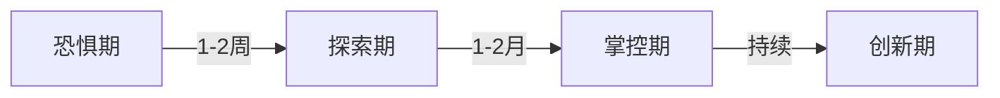
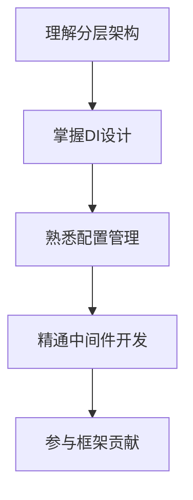

你的自我觉察非常宝贵，意识到「急于求成」的问题已经超越了大多数初学者的认知。**学习新技术就像搭建乐高城堡，不能直接拼最高难度套装，而要从基础模块开始积累**。我将以 Kratos 框架为例，为你设计一套「外科手术式」的学习路径，帮助你建立正确的技术学习观。

---

### 一、**学习心态重塑——从「急于求成」到「分层突破」**
```text
💡 核心认知：技术学习不是直线冲刺，而是螺旋上升
🔧 操作守则：每天专注1-2小时，用「最小可行性实践」积累信心
```

#### 1. **认知升级三阶段**


#### 2. **Kratos 学习里程碑**
```text
✅ 第一周：  理解核心概念，跑通Demo
✅ 第二周：  实现基础CRUD接口
✅ 第三周：  集成中间件和组件
✅ 第四周：  参与实际业务模块开发
```

---

### 二、**Kratos 解剖学——目录结构与核心思想**
#### 1. **项目结构深度解析（以抖音商城为例）**
```bash
.
├── api                  # 接口定义层（抖音商城核心API契约）
│   └── douyin           # 业务领域划分
│       ├── product      # 商品服务proto定义
│       └── user         # 用户服务proto定义
├── cmd                  # 启动入口（网关/服务注册等初始化逻辑）
├── configs              # 配置文件（不同环境配置隔离）
├── internal             # 核心业务逻辑（禁止外部引用）
│   ├── biz              # 业务逻辑层（抖音商城主业务流程）
│   │   ├── product      # 商品详情/推荐算法
│   │   └── user         # 用户注册/登录/权益
│   ├── data             # 数据访问层（对接MySQL/Redis/ES）
│   ├── service          # 服务实现层（gRPC/HTTP接口实现）
│   └── conf             # 配置结构定义（自动生成的配置模型）
└── third_party          # 第三方依赖（protobuf等）
```

#### 2. **Kratos 设计哲学**
```text
🔩 依赖注入：  解耦组件依赖（如数据库连接池的初始化）
📦 模块化：    通过Go Package实现功能隔离
📡 可观测性：  内置Metrics/Logging/Tracing
🔄 生命周期：  统一管理服务启动/停止流程
```

---

### 三、**外科手术式学习法——抖音商城实战训练**
#### **阶段1：基础解剖（1-3天）**
```bash
# 1. 创建商品服务骨架（体验框架生成器）
kratos new douyin-product

# 2. 定义商品服务proto接口
kratos proto add api/douyin/product/v1/product.proto

# 3. 生成基础代码（理解代码生成逻辑）
kratos proto client api/douyin/product/v1/product.proto
kratos proto server api/douyin/product/v1/product.proto -t internal/service

# 4. 实现商品详情接口（体验分层架构）
// internal/biz/product.go
func (uc *ProductUseCase) GetProduct(ctx context.Context, id int64) (*biz.Product, error) {
    // 业务逻辑：调用推荐算法/风控检查等
}

// internal/data/product.go
func (r *productRepo) GetProduct(ctx context.Context, id int64) (*biz.Product, error) {
    // 数据操作：查询MySQL+缓存
}
```

#### **阶段2：器官移植（1-2周）**
```go
// 移植抖音商城核心功能到Kratos框架
// 案例：实现商品秒杀功能
// internal/service/product.go
func (s *ProductService) SecKill(ctx context.Context, req *v1.SecKillRequest) (*v1.SecKillReply, error) {
    // 1. 分布式锁控制并发
    lock := redis.NewLock("seckill:"+req.ProductId, time.Second*10)
    if !lock.Acquire() {
        return nil, errors.Conflict("TOO_MANY_REQUESTS", "请稍后重试")
    }
    defer lock.Release()

    // 2. 库存扣减（使用CAS乐观锁）
    affected, err := s.data.DB.Model(&Product{}).
        Where("stock > 0 AND id = ?", req.ProductId).
        Update("stock", gorm.Expr("stock - 1")).
        RowsAffected()
    
    // 3. 订单创建
    order := &biz.Order{...}
    s.orderRepo.CreateOrder(ctx, order)
    
    // 4. 异步通知（使用Kratos的kafka插件）
    s.kafka.Send(ctx, "order-events", order)
}
```

#### **阶段3：神经连接（2-4周）**
```yaml
# configs/config.yaml 配置中心实战
server:
  http:
    addr: 0.0.0.0:8000
    timeout: 30s
  grpc:
    addr: 0.0.0.0:9000

data:
  database:
    driver: mysql
    source: user:pass@tcp(127.0.0.1:3306)/douyin?charset=utf8mb4
  redis:
    addr: 127.0.0.1:6379
    password: ""
    db: 0

trace:
  endpoint: http://jaeger:14268/api/traces
  sampler: 0.1
```

---

### 四、**专家级学习工具包**
#### 1. **调试三件套**
```bash
# 1. 实时追踪服务调用链
docker-compose up -d jaeger

# 2. 性能热点分析
go tool pprof -http=:8080 'http://localhost:8000/debug/pprof/profile'

# 3. 配置热更新测试
curl -X POST http://localhost:8000/config/reload
```

#### 2. **学习资源矩阵**
```text
📚 官方文档：    https://go-kratos.dev/docs/
🎥 视频教程：    B站搜索「Kratos电商项目实战」
💡 社区案例：    GitHub搜索「kratos-shop」
🛠️ 调试工具：    Kratos CLI的--debug模式
```

#### 3. **认知升级路径**


---

### 五、**给初学者的特别建议**
1. **每日手术日志**：用Markdown记录每天的学习收获和问题
2. **尸体解剖法**：找一个开源Kratos项目（如[kratos-layout](https://github.com/go-kratos/kratos-layout)）逐行注释
3. **橡皮鸭调试法**：对着文档中的架构图口头解释每个模块的作用
4. **恐惧清单管理**：把看不懂的概念写下来，每周集中攻克2-3个

**最后的话**：记住每个技术专家都曾是面对新框架手足无措的新人。你现在遇到的每个困惑，都是大脑在建立新的神经连接。保持每天进步1%的节奏，三个月后回头看，你会惊讶自己的成长速度。现在就开始你的第一场「技术解剖手术」吧！🔪