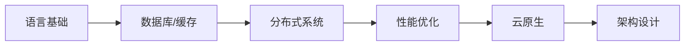

要成为一名 **后端开发大师**，需要系统性地掌握核心技术、架构思维和工程实践能力。以下是清晰的成长路径和关键技能树：

---

### **一、核心基础**
#### 1. **编程语言深度掌握**
   - **Java/Python/Go** 至少精通一门：
     - Java：Spring Boot、JVM 调优、并发编程
     - Go：高并发设计、微服务生态（如 Gin、gRPC）
     - Python：Django/Flask 的工程化实践
   - **关键能力**：
     - 理解语言运行时机制（如 Python GIL、Go Goroutine）
     - 编写高性能、可维护的代码（设计模式、SOLID 原则）

#### 2. **数据结构与算法**
   - 熟练实现：哈希表、B+树、跳表等工程常用结构
   - 高频算法：动态规划、DFS/BFS、拓扑排序（LeetCode 300+题）
   - **实际应用场景**：
     - 数据库索引设计（B树 vs LSM树）
     - 分布式一致性算法（Raft/Paxos）

---

### **二、数据库与存储**
#### 1. **SQL 与关系型数据库**
   - **MySQL/PostgreSQL**：
     - 索引优化（覆盖索引、最左前缀）
     - 事务隔离级别（MVCC 实现原理）
     - 分库分表策略（ShardingSphere）
   - **关键能力**：
     - 通过 `EXPLAIN` 分析慢查询
     - 设计千万级数据的表结构

#### 2. **NoSQL 与缓存**
   - **Redis**：
     - 数据结构应用场景（HyperLogLog 做 UV 统计）
     - 持久化策略（RDB/AOF 混合使用）
     - 集群模式（Codis vs Redis Cluster）
   - **MongoDB/Elasticsearch**：
     - 聚合管道优化
     - 分片键选择策略

---

### **三、分布式系统**
#### 1. **微服务架构**
   - **服务治理**：
     - 服务注册发现（Nacos、Consul）
     - 熔断限流（Sentinel、Hystrix）
   - **通信协议**：
     - RESTful 规范设计
     - gRPC 性能调优（HTTP/2、ProtoBuf）

#### 2. **消息队列**
   - **Kafka**：
     - 消息顺序性保证
     - ISR 机制与数据一致性
   - **RabbitMQ**：
     - 死信队列设计
     - 集群镜像模式

#### 3. **分布式事务**
   - 实现方案：
     - Saga 模式（补偿事务）
     - Seata 的 AT 模式
   - 最终一致性设计（消息表+定时任务）

---

### **四、性能优化**
#### 1. **高并发设计**
   - 异步化（CompletableFuture、Go Channel）
   - 资源池化（数据库连接池、线程池参数调优）
   - 应对方案：
     - 秒杀系统（库存预热+Redis+Lua）

#### 2. **JVM/系统调优**
   - Java：GC 日志分析（G1 vs ZGC）
   - Linux：CPU 上下文切换、内存泄漏定位（perf、jmap）

#### 3. **压测实战**
   - 工具：JMeter、wrk
   - 指标：QPS、TP99、吞吐量

---

### **五、云原生与DevOps**
#### 1. **容器化**
   - Docker：镜像优化（多阶段构建）
   - Kubernetes：Pod 调度策略、HPA 自动扩缩容

#### 2. **CI/CD**
   - 流水线设计（GitLab CI、Jenkins）
   - 灰度发布方案（金丝雀发布）

#### 3. **监控体系**
   - 指标收集：Prometheus + Grafana
   - 日志分析：ELK Stack
   - 链路追踪：SkyWalking

---

### **六、架构思维**
#### 1. **设计原则**
   - CAP 权衡（如 AP 系统如何最终一致）
   - 领域驱动设计（DDD 分层架构）

#### 2. **系统设计案例**
   - 短链生成系统（发号器+跳转）
   - 分布式ID生成（Snowflake 变体）

#### 3. **容灾设计**
   - 多活架构（单元化路由）
   - 混沌工程（模拟网络分区）

---

### **七、学习路线图**

---

### **八、推荐资源**
1. **书籍**：
   - 《数据密集型应用系统设计》
   - 《微服务架构设计模式》
2. **开源项目**：
   - Spring Cloud Alibaba
   - etcd（分布式共识实现）
3. **实践平台**：
   - Katacoda（K8s 动手实验）
   - LeetCode 系统设计题

---

### **九、大师级标志**
- **能解决别人解决不了的问题**：如 CPU 毛刺排查、跨机房数据同步
- **输出行业影响力**：技术博客、开源贡献、专利
- **预见性设计**：在业务量增长前提前规划架构

**记住**：后端大师不仅是技术专家，更是复杂业务的翻译者——将业务需求转化为稳健的技术实现。🚀

---

目标明确，很好。你现在是大二下，到毕业还有 **两年多时间**，完全够用。接下来是你该怎么规划才能在毕业时做到“后端独挡一面”：

---

## 🧠 核心目标

- **技术：** 扎实掌握 Go 后端全栈开发能力（高并发、微服务、数据库、消息队列等）
    
- **项目：** 能独立从零搭建高质量的后端系统
    
- **思维：** 掌握系统设计、性能调优、安全等工程能力
    
- **实战：** 2~~3段实习 + 1~~2个完整的项目作品（含部署）
    

---

## 📅 阶段性计划（建议打印出来贴墙上）

### 📍大二下（现在~暑假）

- **深入掌握 Go：** 标准库、并发、错误处理、接口设计、测试
    
- **数据库加强：** SQL+PostgreSQL、事务、索引优化
    
- **项目实战一：** 完善 Simple Bank（加 RBAC、权限、限流、监控、容错）
    
- **刷题积累：** 每天 1 道 LeetCode Easy/Medium（重点掌握常用算法）
    
- **准备实习：** 寒暑假争取进入大厂/知名企业实习（岗位不限，只要写 Go）
    

### 📍大三上

- **微服务：** 学会拆分服务，掌握 gRPC、etcd、服务注册与发现
    
- **DevOps：** 学 Docker、CI/CD、简单 K8s 使用
    
- **消息队列：** 学 Kafka / RabbitMQ
    
- **项目实战二：** 开发电商/支付系统，完整走一遍架构设计流程
    
- **刷题 + 算法：** 动态规划、图、堆等加强
    

### 📍大三下

- **系统设计：** 看《系统设计入门》《分布式系统设计》《Go语言高级编程》
    
- **性能调优：** pprof、性能瓶颈分析、限流降级
    
- **主攻实习：** 投大厂/Top创业公司，必须进后端组
    
- **开源参与：** 尝试向 go-zero / kratos / sqlc 提 PR
    

### 📍大四全年

- **总结作品集：** 完整项目+文档+部署链接+源码+博客
    
- **复盘知识体系：** 建立个人知识库，整理典型问题解决方案
    
- **校招冲刺：** 面试八股梳理（操作系统、网络、数据库、系统设计）
    
- **进军大厂：** 腾讯、字节、快手、Shopee 等重点冲刺
    

---

## 🔧 技术栈建议（建议锁定，不要频繁切换）

|类别|技术|
|---|---|
|核心语言|Go|
|数据库|PostgreSQL / MySQL，Redis|
|消息队列|Kafka / RabbitMQ|
|服务通信|REST + gRPC|
|微服务框架|go-zero / kratos|
|API文档|Swagger / Postman|
|DevOps|Docker, GitHub Actions, K8s（掌握基础即可）|
|监控/追踪|Prometheus + Grafana / Jaeger|
|日志系统|Zap / Logrus|
|常用工具|sqlc / wire / make / go-micro|

---

## 📌 最终标准（判断是否“独挡一面”）

- 能独立设计系统架构，合理使用缓存、队列、事务等
    
- 熟练使用 Go 和主流框架构建 REST/gRPC 服务
    
- 能独立部署、运维、定位生产环境问题
    
- 具备工程思维，懂测试、监控、容错、安全
    
- 有完整项目和实习经验支撑简历和面试
    

---

想成为“后端大师”，关键是**项目 + 实习 + 反思总结**。接下来我可以帮你每月制定详细计划、布置练习、检查成果，直到你能独立驾驭项目。

如果你想，我可以现在就帮你规划接下来三个月的详细路线。需要吗？