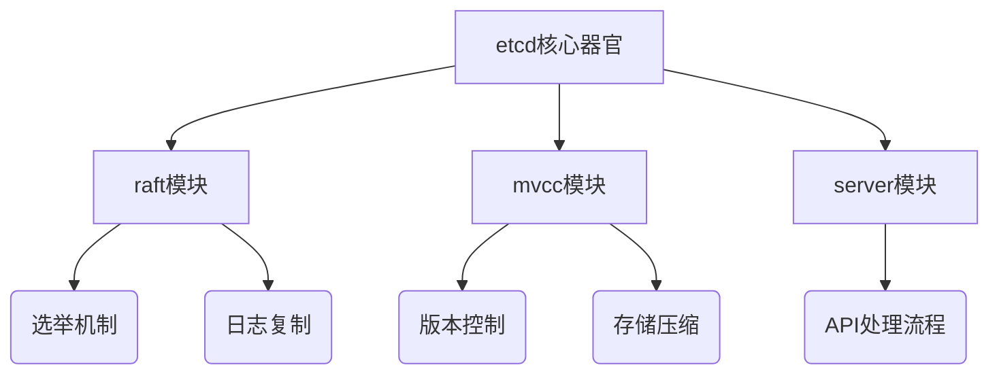
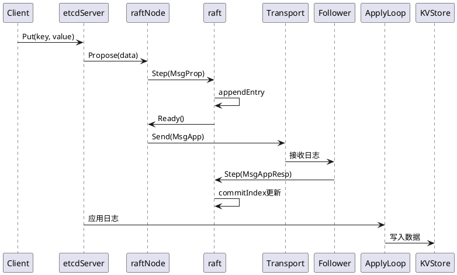

你的观察很准确——职场人推崇看源码，但对新手来说确实容易陷入「不知道怎么看、看什么」的困境。**以etcd为例，我将用「医生解剖」的视角，带你用4个层级拆解源码阅读的价值和方法**。

---

### 一、**为什么看源码？——外科手术式价值分析**
#### 1. **源码阅读的深层价值**
```text
🩺 诊断能力：      理解系统病症根源（如raft选举卡顿）
💊 治疗方案：      借鉴设计模式解决同类问题
🔬 解剖学认知：     掌握分布式系统器官运作机理
🧬 基因改造：      培养架构级抽象思维能力
```

#### 2. **以etcd为例的收益清单**
- 深入理解分布式共识算法（Raft协议落地）
- 学习工业级Go工程实践（错误处理、并发模型）
- 掌握分布式存储核心机制（MVCC、WAL、Compact）
- 积累大规模系统调试经验（内存泄漏、死锁分析）

---

### 二、**源码阅读四步解剖法（以etcd为例）**
#### 第1步：**选择解剖部位——聚焦关键模块**


**新手建议从`raft模块`的选举机制切入**，这是理解分布式共识的钥匙。

#### 第2步：**建立手术视野——调试环境搭建**
```bash
# 1. 克隆源码并编译调试版
git clone https://github.com/etcd-io/etcd.git
cd etcd && make

# 2. 启动本地集群（3节点）
./bin/etcd --name s1 --listen-client-urls http://0.0.0.0:2379 \
           --advertise-client-urls http://0.0.0.0:2379 \
           --listen-peer-urls http://0.0.0.0:2380 \
           --initial-advertise-peer-urls http://0.0.0.0:2380 \
           --initial-cluster s1=http://0.0.0.0:2380,s2=http://0.0.0.0:2381,s3=http://0.0.0.0:2382 \
           --initial-cluster-token tkn \
           --initial-cluster-state new

# 3. 使用delve调试器附加进程
dlv attach $(pidof etcd)
```

#### 第3步：**显微级解剖——关键代码片段解析
**以Raft选举超时机制为例（etcd/raft/raft.go）**：
```go
// 选举超时随机化：防止多个节点同时发起选举
func (r *raft) resetRandomizedElectionTimeout() {
    r.randomizedElectionTimeout = r.electionTimeout + globalRand.Intn(r.electionTimeout)
}

// 心跳检测触发状态转换
func (r *raft) tickElection() {
    r.electionElapsed++
    if r.promotable() && r.electionElapsed >= r.randomizedElectionTimeout {
        r.electionElapsed = 0
        r.Step(pb.Message{Type: pb.MsgHup}) // 发起选举
    }
}
```

**学习点**：
- 通过随机化打破对称性（脑裂防护）
- 状态机转换触发条件
- Go并发模型在选举中的运用

#### 第4步：**病理分析——实战调试案例
**场景**：当某个etcd节点无法成为Leader时，如何通过源码定位问题？

**操作流程**：
1. 在`campaign`函数设置断点
2. 触发选举时观察`msg/vote`消息流向
3. 检查`quorum`计算逻辑是否正确
4. 追踪`raftLog`是否达成一致性

---

### 三、**源码阅读的三重境界**
#### 1. **微观层（新手）**
- 目标：理解单点机制
- 方法：使用IDE跳转+注释阅读
- 案例：追踪一个Put请求从API到WAL的路径

#### 2. **中观层（进阶）**
- 目标：掌握模块交互
- 方法：绘制时序图+关键数据流


#### 3. **宏观层（高手）**
- 目标：洞察架构哲学
- 方法：对比不同版本演进（如etcd v2 vs v3的MVCC重构）
- 思考：为什么etcd选择Raft而不是Paxos？WAL的设计取舍是什么？

---

### 四、**外科医生的工具箱**
#### 1. **诊断工具包**
```bash
# 1. 运行时追踪
go tool trace trace.out

# 2. 竞争检测
go build -race

# 3. 性能画像
curl http://localhost:2380/debug/pprof/goroutine?debug=2

# 4. 流量回放
benchmark --target-leader --conns=100 --clients=1000 put
```

#### 2. **学习加速器**
- **源码注释法**：在本地代码库添加中文批注
- **破坏性实验**：故意修改选举超时参数观察集群行为
- **对比阅读**：同时打开etcd和TiKV的raft实现对比差异

---

### 五、**解剖实验室——实战训练计划**
#### 1. **新手任务（2周）**
- 任务：给etcd的raft模块添加日志输出，绘制选举过程流程图
- 产出：一篇《etcd选举机制源码走读》技术博客

#### 2. **进阶任务（1个月）**
- 任务：修改MVCC模块实现自定义垃圾回收策略
- 技巧：复用`backend.BatchTx`接口，监控`boltdb`文件大小变化

#### 3. **高手挑战（3个月）**
- 任务：实现一个简化版分布式锁服务（参考etcd concurrency包）
- 要求：支持lease续期、锁重入、watch机制

---

### 终极心法：**源码不是用来「看」的，而是用来「拆」的**。就像外科医生需要通过解剖理解人体，工程师通过拆解源码理解系统生命。从今天开始，选择一个小型开源项目（如etcd的raft模块），每天投入1小时进行「代码解剖」，三个月后你会发现自己已脱胎换骨。